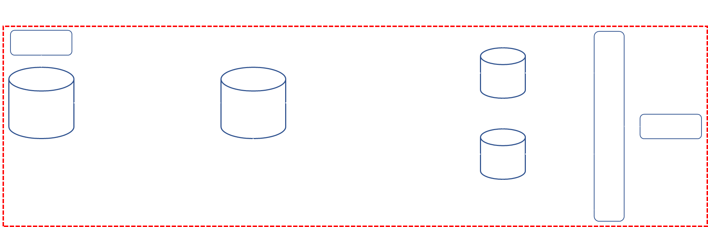
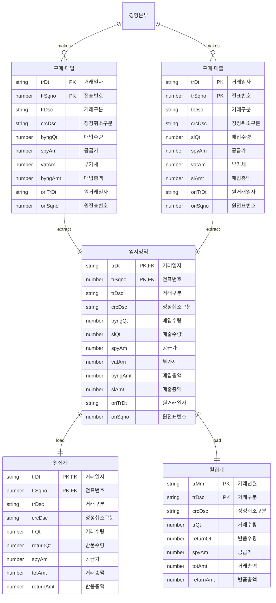

## 들어가며

본 문서는 기간계 시스템 내 경영본부 매입/매출 일집계 테이블에 데이터를 적재하는 배치 프로그램을 개선한 과정을 다룹니다.

타 업무 수행 중 발견한 오류를 통해 문제를 식별하고 테이블의 데이터를 사용목적에 맞게 적재하는 프로세스를 구성, 기존 자료에 대한 클렌징을 진행하였습니다.

## 개선 추진 배경

경영본부 매입/매출 일집계 테이블은 기간계 시스템 내에서 처리된 거래 중 경영본부에 해당하는 건을 한정하여 일단위 집계 데이터를 적재하는 테이블입니다.

해당 테이블 및 적재 배치는 2013년 통합시스템 고도화 작업 시 추가되었으며, 경영본부가 사용하는 매입/매출실적 조회, 손익분석보고서 등의 서비스 제공에 사용되고 있습니다.

관련하여 별도의 개선 요청은 없었으나, 사용하지 못하고 있던 석유제품 수급보고 서비스 재개발 작업 중 우연히 해당 테이블의 데이터가 오적재되고 있음을 확인하였고, 이를 통해 매입, 매출 및 입/출하 실적이 잘못 제공될 수 있다는 우려가 있었기에 본 테이블에 대한 적재 배치의 수정 및 데이터 클렌징 작업을 진행하게 되었습니다.

## 기존 프로그램의 문제

테이블의 데이터 정합성을 보장할 수 없게된 가장 큰 원인은 매일 실행되고 있는 배치 프로그램의 구조적인 문제로 프로그램 내부에서 발생한 문제는 아래와 같습니다.

### 1. 단순 입력만이 존재하는 배치

기간계 시스템에서 일어나는 매입, 매출의 경우 정상거래를 기본으로 하지만, 경우에 따라 오기표된 항목에 대한 정정/취소, 매입, 매출건에 대한 일부 품목의 환출/입이 일어나고 있으며, 이와 더불어 상품과 직접적인 연관은 없지만, 매입, 매출거래에 영향을 주는 제비용, 정산차액 등이 함께 기표되고 있습니다.

이 중 금번 개선에서 다루는 일집계 테이블의 데이터 적재 배치는 경영본부의 유류 상품에 대한 매입, 매출 자료를 한정하여 해당 테이블에 적재하는 배치로 당초 모든 일단위 거래 데이터를 적재하는 것을 목적으로 하고있습니다.

허나, 실제 데이터를 적재하는 배치 프로그램의 동작은 당일을 기준으로 1일 전의 자료를 단순히 추가만 하는 형태로 정정거래 및 당일 발생한 환출/입 거래는 반품 수량 및 금액으로 등록되나, 이전 일자에 발생한 취소거래 및 환출/입 거래에 대한 수정이 일어나고 있지 않았습니다.

이는 취소 및 환출/입 거래가 수시로 발생하는 업무의 특성상 데이터의 정합성을 크게 훼손하였으며, 시간이 지날수록 집계가 크게 틀어져 매입량이 매출량보다 많게 표시될 정도의 오류가 발생하고 있는 상황이었습니다.

### 2. ETL이 아닌 별도 배치 프로그램을 통한 동작

정보성 데이터의 이관을 위한 ETL이 존재함에도 레거시 코드의 재사용으로 인해 ETL Job이 아닌 백엔드 내 배치 프로그램의 형식으로 구현되어 타 데이터 이관 작업과 별개로 관리되고 있었으며, 배치의 실행을 법인 내 타 시스템에 의지하고 있어 불필요한 의존성을 가지고 있었습니다.

이와 더불어 Truncate, Index unuse, Index rebuild 등의 프로시저 사용이 불가했기에 기존 적재 데이터에 대한 삭제가 발생할 시 delete에 의지하여야 했으며, 이는 인덱스를 사용하고 있는 테이블의 특성 상 삭제 후 테이블스페이스에 불필요한 데이터를 남기는 등의 영향을 끼치고 있는 상황이었습니다.

이러한 문제를 가진 상태로 기간계 시스템 오픈 이후 데이터에 대한 오적재가 지속적으로 진행되고 있었으며, 이로인해 3개 이상의 서비스가 영향을 받고 있는 상태였고, 인덱스를 비활성화하지 않은 상태에서 대량의 데이터를 적재하고 있던 탓에 적재 시점에서 DB의 자원이 필요 이상으로 사용되고 있는것이 확인되었기에 이에대한 개선이 필요하다고 생각했습니다.

## 문제해결 방안에 대한 고민

문제가 비교적 명확히 정의되어 있고 데이터 적재를 위한 도구와 방법이 모두 준비된 상황이었기에 배치를 ETL Job으로 재설계하는 방향으로 결정하고 데이터를 어떻게 적재할 것인지에 초점을 맞춰 업무를 진행하였습니다.

### 1. 취소, 환출/입 거래의 반영

기존 배치 프로그램의 경우 매입, 매출 테이블의 거래구분과 상세내역의 상품 정보를 일집계 테이블에 적재하고 있었으며, 이 중 정정거래의 경우 원거래 외 추가 거래를 통해 음수기표를 하고 있던 원본 데이터와 달리 기존 거래의 "반품 수량", "반품 금액"의 컬럼에 테이터를 양수로 병합하여 적재하고 있었습니다.

이러한 적재방식은 당일 동일 거래에 음수가 발생하는 정정거래에는 적용할 수 있었지만, 익일 이후 거래내역에 대한 상계를 위해 차/대변을 반대로 기표하는 취소거래에는 적합하지 못했기에 취소거래 등의 발생 등을 확인하기 위한 원거래정보 컬럼을 추가하고, 별도의 거래로 기표하는 방향으로 설계를 변경하였으며, 환출/입 거래의 경우만을 "반품 수량", "반품 금액" 컬럼을 사용하여 기표하도록 수정하기로 하였습니다.

### 2. 기존 데이터의 수정

추가된 데이터와 별개로 익일 취소, 환출/입이 발생한 거래에 대한 수정이 필요하였기에 취소, 환출/입 거래의 반영을 위해 추가된 원거래정보 컬럼을 바탕으로 원거래를 Update하는 로직을 추가하였습니다.

### 3. 프로시저의 실행

기존 별도의 프로시저 사용없이 자료 삭제 시 `Delete`만을 진행하는 것과 달리 데이터 입력 전 자료 삭제를 위한 `Truncate`, `Index Unuse` 작업 후 `Index rebuild` 등이 필요했기에 이에 대한 처리 방법을 고민하였습니다.

회계 업무를 포함하는 시스템의 특성 상 단일 업무시스템 내에서 자료를 완전히 삭제하는 프로시저를 관리할 수 없었기에 해당 동작의 수행은 전 법인 공통 DB모듈을 사용하여 처리하기로 하였으며, 해당 모듈의 사용을 위해 업무에서 사용하는 테이블에 한하여 실행 권한을 획득하였습니다.

## 문제 해결을 위한 개선내역

위 문제해결 방안에 따라 실제 수행한 개선내역은 아래와 같습니다.

### 1. ETL Job 생성

데이터 적재에 필요한 모든 행위를 자동화하기 위해 소스 테이블과 타겟 테이블에 대한 ETL Job을 신규 생성하였으며, 데이터 적재를 위한 프로세스를 아래와 같이 구성하였습니다.

원천 DB와 타겟 DB의 스키마가 서로 상이했기에 원천 데이터를 임시영역으로 추출 후 재가공 하였으며, 재가공된 데이터를 입력하기 전 무결성 제약조건으로 인한 오류 발생 방지를 위해 Truncate를 실행, 이후 Insert 속도 확보 및 DB 자원 사용률 감소를 위해 Index Unuse 프로시저를 전처리 프로세스에 추가하였습니다.

적재 완료 후에는 인덱스 사용을 위해 리빌드를 수행하였으며, 적재된 데이터의 정합성은 ETL 프로그램의 추출, 적재 건 수 비교를 통한 물리적 검증, 추출 데이터와 적재 데이터 내 매입/출 수량 및 총액의 합산 비교를 통한 논리적 검증을 통해 보장하였습니다.

### 2. 데이터 매핑사항 및 수정사항 반영을 위한 동작 추가

ETL Job 생성 시 사용된 테이블이 아래와 같이 구성된 상태였고, 취소거래 및 환출/입 거래에 따른 원거래 수정이 필요했기에 이에 대한 매핑사항을 수정하고 동작을 추가하였습니다.

테이블에 구성에서 확인 할 수 있듯이 원천 테이블의 경우 원거래일자와 원거래전표 번호를 통해 정정/취소 및 환출/입 거래에 대한 추적이 가능하였으나, 일집계 테이블에는 해당 정보가 존재하지 않아 반품수량과 반품총액으로 해당 거래를 반영하고 있는 상황이었습니다.

정정거래의 경우 당일 발생한 거래에 대한 내역이기에 집계 반영이 되고 있었기에 별도의 수정을 거치지 않았으며, 취소 및 당일자가 아닌 환출/입 거래의 경우 정정취소구분을 이용하여 해당 거래건을 발췌 후 Insert 및 원거래에 대한 Update를 수행하도록 동작을 추가하여 당일자 외 거래 발생 시에도 집계 자료가 정상적으로 조회될 수 있도록 구현하였습니다.

이와 더불어 기존 데이터 조회 시 취소 거래에 대한 내역이 일반 합계에 계산되어 나와 물량 및 매출/입 총액이 잘못 제공되고 있는 서비스가 존재하였는데, 이 부분의 경우 쿼리 단에서 취소거래에 대한 집계를 별도로 진행하는 방식으로 수정하여 문제를 해결하였습니다.

### 3. 온디멘드 배치 프로그램 개발

기존 배치를 ETL Job으로 변환하여 개발함으로써 잘못 수행되고 있던 기능 등은 개선이 되었으나, 일단위 수행이라는 동작의 한계 상 실시간 데이터 활용이 필요할 경우 당일자의 데이터를 확인할 수 없다는 단점은 여전히 존재하고 있었습니다.

당장은 당일자 데이터까지 포함한 자료를 활용하고 있는 프로그램은 존재하지 않았지만, 차후 시스템의 발전 방향을 고려하였을 때, 타 업무 도메인의 테이블을 직접 참조하는 상황을 줄이는 것이 바람직했기 때문에 본 테이블 활용 시 실시간 데이터 반영이 가능한 방안을 고려하는 것이 맞다고 판단하였습니다.

이를 위해 별도의 ETL Job을 구성하고 필요시 마다 호출하는 방식을 고려한 바 있으나, ETL 서버는 Was 서버와 분리되어 Job의 원격 실행이 불가하여 사용자가 필요시마다 수시로 호출할 수 없었기에 고려대상에서 제외하기로 하였습니다.

이러한 문제를 해결하기 위해 새로이 고안한 것이 온디멘드 배치 프로그램으로 실시간 데이터의 활용이 필요한 서비스는 본 테이블을 조회하기 전 온디멘드 배치를 호출하고, 거래일자와 거래전표를 기반으로 최종 적재 시점 이후의 데이터를 업데이트 후 사용할 수 있도록 설계하였습니다.

### 4. 데이터 클렌징 작업

신규 적재 대상 데이터에 대한 정합성 또한 중요하지만 그만큼 중요한 것이 기존 데이터에 대한 클렌징 작업이었기에 이를 위한 별도 작업을 진행하였습니다.

기존 테이블의 경우 2013년 이후 모든 데이터가 적재되어 있었으나, 데이터의 신뢰도가 떨어지고 시스템의 데이터 관리 정책 상 5년 7개월 이전 데이터의 경우 파기 혹은 분리보관하는 것이 원칙이었기에 본 개선을 통해 불필요 데이터를 삭제하고 데이터의 정합성을 회복할 필요가 있었습니다.

이를 위해 별도의 ETL Job을 구성하였으며, 기존 프로세스와 동일하게 동작하되, 그 기간만 시스템 공통코드 테이블에 존재하는 데이터 분리보관 시점으로 지정하여 클렌징 작업을 진행하였습니다.

## 안정적인 배포를 위한 고민

모든 개선 작업을 완료한 이후 안정적인 배포를 위해 아래와 같은 사항들을 고려하였습니다.

### 1. 서비스 영향도 분석

여러 서비스에서 참조하고 있는 테이블인 만큼 오배포에 의한 서비스 중단 사태를 방지하기 위해 모든 참조 서비스의 사용여부 및 타 서비스를 통한 대체 가능성을 고려하였습니다.

|                **서비스명** |  **참조 테이블** |         **대체 가능여부** |     **대체 서비스** |                    **비고** |
| --- | --- | --- | --- | --- |
| 매입실적 조회 |      일집계 |           O | (구매) 경영본부 매입내역 조회 |  |
| 매출실적 조회 |      일집계 |           O | (구매) 경영본부 매출내역 조회 |  |
| 손익명세서 출력 |      일집계 |           X |  | 연 1~2회 사용 |
| 거래상황기록부 |      월집계 |           X |  | 미사용, 재개발 진행 |
| 거래상황기록부(현장 사업소) |      일집계 |           X |  | 직영주유소 한정, 쿼리는 동작하나 실제 동작 없음 |

조사 결과 테이블을 참조하는 모든 서비스가 대체가 가능하거나, 실제로는 사용하고 있지 않기에 업무에 큰 지장을 주지 않는다 판단하였고, 배포 전 담당자 공지 및 배포 중 매입/출실적 조회 화면에 대한 접근 제어만을 수행하기로 하였습니다.

### 2. ETL Job 실행시간 및 파라미터 설정

신규 생성된 ETL Job을 이전과 같이 매일 주기적으로 실행하여야 했기에 자동 실행을 위한 시간 자료 발췌를 위한 파라미터를 설정하였습니다.

실행시간의 경우 기간계 시스템에서 사용하는 집계성 테이블의 적재 시간대인 0시 5분 ~ 0시 30분 사이에 실행되어야 했으며, 원천 테이블인 구매 매입/출 테이블의 조회가 겹치지 않는 시간로 설정하여야 했기에 이를 모두 충족하는 0시 15분으로 설정하였습니다.

실행 파라미터의 경우 당초 1일 이전일자를 계산하여 입력하는 것으로 계획하였으나, 당일 실행되는 모든 Job이 동일한 파라미터를 가지고 동작했기 때문에 공통 파라미터를 받아와 쿼리 내에서 1일 이전일자를 계산하는 것으로 수정하였습니다.

### 3. 온디멘드 배치 서비스 배포

온디멘드 배치의 경우 신규 개발건임과 동시에 현재 사용하고 있는 서비스가 존재하지 않고, 배포에 따른 영향도가 존재하지 않기에 개발이 완료되는데로 바로 실배포를 진행하는 것으로 계획하였습니다.

## 배포 후 모니터링

배포 계획에 따라 실배포를 진행하고 배포에 따른 영향도 파악을 위해 서비스 및 인프라에 대한 모니터링을 수행하였습니다.

### 1. 서비스 모니터링

개선 후 서비스에서 사용하는 조회 쿼리에 관여하는 컬럼에 변동은 없었기에 동작 자체에 대한 모니터링보다는 데이터의 변동으로 인해 발생할 수 있는 부분에 초점을 맞춰 모니터링을 진행하였습니다.

가장 먼저 진행한 것은 원천 데이터와 거의 동일한 출력을 가지는 매입/출 실적과 경영본부 매입/출내역을 비교하는 것으로 동일 조건으로 조회한 결과를 비교했을 때 기 적재된 기간과 일단위 작업을 통해 적재된 데이터 모두 정합성이 맞는 것을 확인할 수 있었습니다.

이후 진행한 것은 사용자의 서비스 호출에 따른 결과에 대한 모니터링으로 일/월집계 테이블을 활용하는 서비스를 한정하여 SQL의 실행결과가 0건인 트랜잭션을 모니터링하고 해당 호출이 단순히 검색조건으로 인해 매칭되는 데이터가 나오지 않은 것인지, 실제로 데이터의 적재가 잘못되어 데이터가 나오지 않는 것인지를 확인하였습니다.

### 2. 자원 모니터링

개선에 따른 인프라 차원의 영향도 파악을 위해 DB 자원 모니터링을 수행하였습니다. 작업 수행형식과 동작이 기존 작업과 상이하여 메모리와 SQL의 성능에 대한 모니터링은 정확한 비교가 불가하였기에 본 작업에서는 CPU를 과도하지 않게 사용하고 있는지를 중점으로 모니터링 하였습니다.

다만, DB의 통제권이 타법인에 있고 시스템 운영담당자에게 성능 모니터링을 위한 Role 및 Privilege가 부여된 계정이 존재하지 않았기에 금번 업무에서는 법인 통합관제시스템 내 등록된 시간대별 서버 사용량 정보를 활용하여 단편적 모니터링만을 진행하였으며, 모니터링 결과 작업수행 시 CPU 사용률이 평균 4%p 가량 감소한 것을 확인할 수 있었습니다.

실배포 이후 약 일주일간 위와 같은 모니터링을 수행한 결과 큰 오류사항은 발생않았기에 프로그램의 수정 및 배포가 정상적으로 이루어진 것으로 판단하고 개선과 관련된 모든 작업을 종료하였습니다.

## 후기

레거시 시스템의 경우 ETL이 별도로 존재하지 않았고 배치 프로그램으로 위와 같은 동작을 수행하였기에 직접 ETL을 사용하여 업무를 진행해본 것은 이번이 처음이었던 것 같습니다.

문제 해결 자체에는 많은 시간이 걸리지 않았지만, ETL 프로그램 사용방법 숙지와 기존의 프로그램을 새로운 형식으로 변경하는 것에 대한 설득을하는데 생각보다 많은 시간이 소요되었던 것 같습니다.

### 프로그램 사용방법의 숙지

이관을 위한 Job 자체는 이미 구현된 예제들이 있어 구성하는데 큰 어려움은 없었지만, 임시영역 내 테이블 스키마 적용, 컬럼 매핑, 테이블별 전·후처리 등의 기능을 사용하고 있던 구현물이 없었기에 직접 메뉴얼을 보고 시행착오를 거치며 프로세스를 완성하는데 시간이 많이 소요됐던 것 같습니다.

### 구현 변경에 대한 설득 과정

데이터가 잘못 적재되고 있긴하였으나, 배치 프로그램 자체에서 오류가 발생하거나 하진 않았기에 완전히 새로운 방식으로 변경해야할 필요성을 못느끼고 있다는 점이 가장 크게 작용했고 차세대 시스템 구축으로 환경이 변화했음에도 대부분의 IT담당자가 레거시 시스템과 동일하게 진행하는 것이 좋다 라는 생각을 가지고 있었기에 객관적인 자료를 통한 설득이 필요했던 것 같습니다.

이 과정에서 멘토링 세션에서 들었던 PoC를 통한 타당성의 검증에 관한 내용이 떠올랐고 추상적인 말보다는 객관적인 구현물을 시연하며, 새로운 방식이 얼마나 더 편하고, 효율적으로 업무를 진행할 수 있게 하는지를 불필요한 마찰 없이 설득할 수 있었던 것 같습니다.
