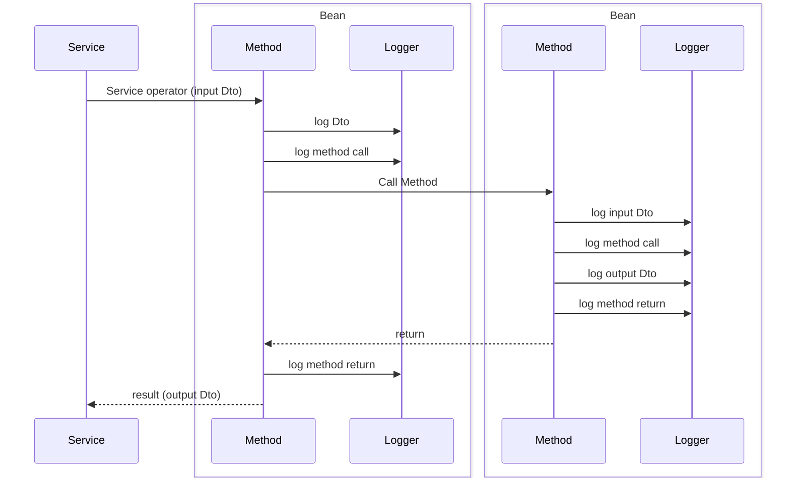
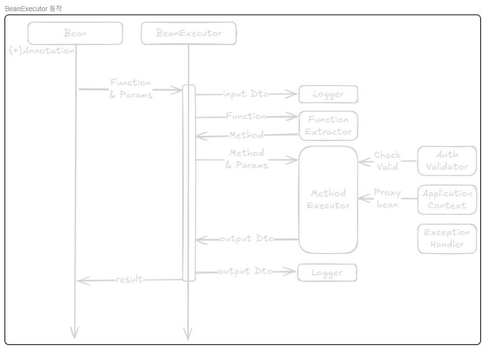

## 들어가며

`Spring Framework`를 래핑한 프레임워크를 사용하는데 `Spring AOP`, `AspectJ`의 사용이 불가하여 로깅과 권한 등의 관심사를 분리할 수 없는 상황에서는 어떻게 해야할까요?

그리고 이로인해 조직의 개발 생산성과 시스템의 유지보수성이 저하되고 있는 상황이라면 어떻게 해쳐나가는 것이 좋을까요?

이 문서는 현재 업무 중 백엔드 서버 구축에 사용하고 있는 상용 프레임워크에서 `Spring AOP`, `AspectJ`의 사용없이 나만의 `AOP`를 구현한 이야기를 담고 있습니다.

## 문제의 발단

여느때와 다름없이 코드베이스의 소스코드를 수정하고 리팩토링하는 중 의문을 가지기 시작했던 것이 발단이었던 것 같습니다.

> ***"프레임워크 메뉴얼에 나와 있긴 한데 이걸 왜 계속 반복해서 사용하고 있는거지?"***

차세대 시스템이 한창 구현 중이었던 입사 초기부터 가져왔던 의문이었지만, 당시에는 이미 프로젝트의 암묵적 표준으로 자리 잡은 상태였고 당장의 구현이 급한 상황이었기에 넘어갔지만

시간이 지나 시스템의 운영이 어느정도 안정화되고 기술부채가 되어버린 레거시 소스코드를 리팩토링하고 있는 현 상황에서는 이는 다시 한번 생각해봐야 하는 문제가 되어있었습니다.

```java
@FrameworkBean
Public class TestBizLogic {

	private Logger logger;
	private TestDao testDao;
	private UserAuth userAuth;

	@BeanInfo(name = "테스트 데이터 가져오기")
	public TestOutDto GetTestData(TestInDto input) throws FrameworkException{

		TestOutDto output = new TestOutDto();
		TestDaoIn daoIn = new TestDaoIn();
		List<TestDaoOut> daoOuts;

		/* 반복의 시작점 */
		logger = LoggerFactory.getLogger(getClass());
		ApplicationContext.getbean(testDao, TestDao.class);
		ApplicationContext.getbean(userAuth, UserAuth .class);

		logger.debug("input: {}", input);
		BeanUtils.copyproperties(input, daoIn);
		logger.debug("daoIn: {}", daoIn);

		boolean isValidUser = CheckUserAuth();
		if(!isValidUser) throw new FrameworkException("ALERT", "권한이 잘못되었습니다.");;

		try{
			daoOuts = testDao.selectListTestData(daoIn);
		}catch(Exception e){
			throw new FrameworkException("ERROR", "에러가 발생하였습니다");
		}

		logger.debug("daoOut: {}", daoOut);

		if(daoOuts == null || daoOuts.size() == 0) {
			ApplicationContext.setMessage("조회 결과가 존재하지 않습니다.");
			return new TestOutDto();
		}

		output.setResultCnt(daoOuts.size());
		BeanUtils.copyproperties(daoOuts, output.getResultList(), TestOutSubDto.class);
		ApplicationContext.setMessage("{}건의 결과가 조회되었습니다.", daoOuts.size());

		logger.debug("output: {}", output);

		return output;

	}

	@BeanInfo(logicalName = "사용자 권한 검증")
	private boolean CheckValidUser(){
		// 사용자 검증
	}

	/* 반복의 종료점 */
}
```

위 소스코드는 `Spring MVC`, 3-계층 구조를 가지고 있는 현행 시스템 `Service` 계층의 보일러플레이트를 재연한 것으로 **아주 간단한 `CRUD` 기능을 수행하는 쿼리만을 호출하지만 40여 줄의 소스코드가 작성**된 모습을 확인할 수 있었습니다.

`Logger` 인스턴스를 가져오는 것으로 시작해 사용자 권한 검증을 거쳐 값이 반환 되는 순간까지의 소스코드는 프레임워크 메뉴얼 내 예시코드로 사용된 바 있기에 **코드베이스 내 거의 모든 소스코드에서 반복**되고 있었습니다.

이와 더불어 새로운 프로그램을 개발할 때도 이를 복제하고 메소드 호출부만 수정하여 사용하고 있는 실정이었습니다.

작성된 코드 내 메소드 실행 전 후 입/출력값의 로깅, 권한 검증 등이 모두 포함되어 있어 프로그램의 기본적인 동작에 큰 문제는 없었으나, 과도하게 반복되는 코드로 인해 소스코드의 가독성과 유지보수성이 떨어지고, 무분별한 복제로 인해 잘못된 서비스를 호출하거나, 아예 연관이 없는 메세지를 표출하는 등 크고 작은 문제 또한 발생하고 있었습니다.

다만, 이러한 문제는 이미 많은 분들이 충분히 많이 고민하고 좋은 기술들이 라이브러리화된 분야이기에 해결책은 어느정도 알고 있었습니다. `Spring Framework`의 가장 큰 특징이 `DI(Dependency Injection)`, IoC와 더불어 AOP라는 걸 알고 있었기에 Spring AOP나 AsjectJ를 사용하면 되겠구나! 라는 생각을 하게 되었고

마침 작업 중인 레포지토리 내  `build.gradle`을 통해 `Spring AOP`와 `AspectJ`에 대한 의존성이 모두 포함되어 있는 걸일 확인할 수 있었기에 프로젝트 전체에도 적용할 수 있다는 생각이 들었습니다.

> ***"설정만 확인하면 어떻게 구현해야할 지 알 수 있겠다!"***

## 재앙의 시작

사용하고 있는 상용 프레임워크의 경우 `Spring Framework 5.X` 이전의 버전을 기반으로 하고 있었기에 가장 먼저 메인 프로그램 엔트리 포인트의 설정 `XML` 파일을 찾아보기로 하였습니다.

전체 시스템 구성과 관련하여 단순한 구성도는 존재하였지만 이를통해 실제로 어디에서 시스템의 동작이 시작되고, 그 설정이 어떻게 구성되어 있는지는 알 수 없었기에 시스템의 공통 기능을 담당하는 팀에 문의하였으나, **차세대 시스템 구축 당시 위탁 업체를 통해 프레임워크 설정을 진행한 이후 누구도 이를 수정하거나, 문서화 한 내역이 없기에 엔트리 포인트의 위치를 특정할 수 없다**는 답변만을 받을 수 있었습니다.

때문에 저는 **주어진 최소한의 단서를 조합하여 몇 가지 가설**을 세워야만 했으며, 엔트리 포인트를 찾는 과정에서 세웠던 가설은 아래와 같습니다.

### 1) 공통 기능 모듈 내 존재

- 현재 프로젝트 구조는 각 업무 도메인에서 자체적으로 코드베이스를 관리하고, 이를 개별 빌드하여 `WAS(Web Application Server)`에 배포하는 멀티레포 형태의 프로젝트로 모든 업무는 통신 기능이 포함된 공통 기능 모듈을 거친 후 서비스가 호출되고 있었습니다.
- 이에 공통 기능 모듈이 서비스 전반의 동작 환경을 담당하고 있기에 공통 기능 모듈 내 시스템의 엔트리 포인트가 존재할 것이라 가정하였으나, 실제로 확인한 결과 해당 모듈에는 엔트리 포인트가 존재하지 않았습니다.

### 2) WAS(Web Application Server) 내 존재

- 다음으로 세웠던 가설은 `WAS`내 서블렛 컨테이너(`Tmax JEUS`)의 설정 디렉토리에 엔트리 포인트가 존재한다는 가설이었습니다.
- 프로그램 수정 후 로그를 확인하던 도중 우연히 발견한 것으로, 관리자 페이지에 표시되는 프로그램 로그의 최상단에 logback.xml의 경로가 존재하였는데, 해당 파일이 `WAS` 내 미들웨어 디렉토리 내 존재한다는 사실을 확인하였고, **대부분의 경우 logback과 엔트리 포인트 설정이 같은 디렉토리에 존재한다는 경험칙을 바탕으로 확인**을 시작하였습니다.
- 관련 사항을 확인한 결과 **서블렛 컨테이너 디렉토리 내 메인 프로그램의 엔트리 포인트가 존재**한다는 것을 확인하였고, 이를 이용해 본격적으로 `AOP`를 적용할 준비를 시작하였습니다.

## 뜻밖의 답변

엔트리 포인트 설정 파일의 경우 `Spring`의 설정 파일과 상이한 부분이 있어 프레임워크를 관리하고 있는 솔루션사에 문의하여 작업을 진행하려 하였으나 뜻 밖의 답변을 듣게되었습니다.

> ***"이전 버전까지는 `AOP` 설정을 지원했지만, 이번 버전부터는 성능상의 이유로 `AOP` 설정을 공식적으로 지원하지 않고 있습니다."***

프레임워크의 특징 소개 페이지에 장점으로 까지 기재되어 있던 사항이 현재는 공식지원 조차 되고 있지 않는 상황에 약간 당황하였지만, 다행히 비공식적으로 설정 자체는 가능하다는 답변을 들었기에 우회 설정을 통해 `Spring AOP`와 `AspectJ`를 활성화하고 간단한 테스트를 진행해 보았습니다.

## 절망적인 현실

드디어 `AOP`를 적용할 수 있다는 사실에 들떠있는 저에게 돌아온 것은 밝은 미래가 아니라 절망적인 현실이었습니다.

설정 후 컨테이너를 재기동 했을 때, 프레임워크 구조상의 문제 때문인지 단일 업무 패키지에만 적용 했음에도 **평소와 비교해 힙메모리 사용량이 10% 가량 증가해버리는 상황**을 마주하게 되었습니다.

이는 트랜잭션이 몰리는 피크 시간대 전체 힙메모리의 90% 가량을 사용하는 시스템의 상황을 고려해봤을 때 사실상 거의 수용할 수 없는 수치였고, 이는 곧 `Spring AOP`를 적용할 수 없다는 말과 같았습니다.

## 어떻게 해결하면 좋을까?

`AOP`를 구현한 기능을 활용할 수 없어 개발 편의성과 유지보수성이 떨어지고 있고, `Spring AOP`, `AspectJ`를 이용할 수 없다는 건 알겠는데 그럼 문제를 어떻게 해결하지?

로깅, 권한관리 등의 횡단관심사를 분리하는 것이라는 것만 알고 구현체만을 사용했지 이를 직접 구현해본 적은 없었기에 문제를 해결을 위해 직접 구현해야 할 지 포기하고 받아들어야 할 지 혼란스러웠습니다.

하지만 앞으로 이 환경에서 개발을 진행하기 위해서는 문제의 해결이 꼭 필요해보였고 이번 기회를 통해 `AOP`를 조금 더 잘 이해할 수 있을 것이라는 생각이 들었기에 해결책을 한번 찾아보기로 했습니다.

문제를 해결하기 위해 가장 중요한 것은 문제가 무엇인지 아는 것이라 생각하기에 과연 `AOP`가 정확히 무엇인가를 먼저 찾아보았고, 검색을 통해 얻은 `AOP`의 정의는 아래와 같았습니다.

> AOP(Aspect-Oriented Programming, 관점 지향 프로그래밍) 란 소프트웨어 개발에서 핵심적인 비즈니스 로직과 부가적인 기능(횡단 관심사, Cross-Cutting Concerns)을 분리하여 모듈화하는 프로그래밍 패러다임입니다. 여기서 "횡단 관심사"란 로깅, 보안, 트랜잭션 처리 등과 같이 여러 모듈이나 컴포넌트에 걸쳐 반복적으로 등장하지만, 비즈니스의 핵심과는 직접적으로 관련 없는 기능을 의미합니다.

기존에 알고 있던 개념과 크게 다르지 않은 설명이었고 설명이 워낙 추상적이다보니 정의만 보고는 무엇이 어떻게 처리 되는지 알 수 없었습니다.

때문에 `AOP`의 주요 개념에는 무엇이 있는지 조금 더 찾아보았고 그 결과로 얻은 내용은 아래와 같았습니다.

> AOP에서는 다음과 같은 주요 개념이 사용됩니다.
>
> - **Aspect**: 횡단 관심사를 구현한 모듈
> - **Join Point**: Aspect가 적용될 수 있는 지점(예: 메소드 호출)
> - **Advice**: 실제로 실행되는 부가 기능(코드)
> - **Pointcut**: Advice가 적용될 Join Point를 지정하는 규칙
> - **Weaving**: Aspect와 핵심 로직을 합치는 과정

개념까지 찾아보고 나니

## 그래서 그게 가능하긴 한거야?

결론부터 말하자면 "가능할 것 같은데?" 라는 생각이 들었습니다. 계속해서 반복되고 있는 로깅과 예외처리, 권한 식별과 같은 횡단 관심사의 동작이 비교적 간단하여 모듈화하기 수월해보였고, 해당 기능들이 실행되는 시점이 명확했기에 `Pointcut`또한 비교적 명확해 보였습니다.

## 생각보다 별거 아닌데?

## 처음 만난 커다란 벽

Aspect와 Advice를 설계할 때 까지만 하더라도 뭔가 금방이라도 나만의 AOP를 완성할 수 있을 것만 같았습니다. Join Point라는 커다란 벽을 만나기 전까지는 말이죠..

Spring AOP나 AsjectJ를 사용할 때는 JoinPoint 객체를 이용해 적용 지점을 확인하고 그에 따른 Advise를 작성하는 것이 너무나도 자연스러웠지만 해당 기능이 없는 지금의 상태에서 어떻게 해당 지점을 식별해야하지? 라는 생각이 문득 들었습니다.

## 문제를 단순화하니 보이는 해결책

`Join Point`를 어떻게 구현해야하나 고민 하던 중 문득 이런 생각이 들었던 것 같습니다.

> ***"그런데 꼭 모든 적용 지점을 구현할 필요가 있을까?"***

단순히 생각해보면 제가 해결하고자 하는 문제는 DB를 통한 데이터의 조회나 입력이 일어나는 레포지토리의 메서드 실행 혹은 비즈니스 로직의 실행 시점으로 한정되어 있는데 **굳이 전체 메소드 호출을 살펴볼 필요가 있을까** 라는 생각을 하게되었고 **문제를 조금 더 단순화** 해보기로 했습니다.

단일 메소드의 호출로 `Join Point`가 어느정도 한정된 상황에서 우리에게 진짜로 필요한 것은 무엇인가를 생각했을 때 얻은 결론은 간단했습니다.

> ***"그냥 메소드 실행의 앞 뒤로 무엇이 진행될 것인지만 정하면 되는거잖아?"***

## 프로토타입의 설계

이론적으로는 가능하다고는 하나, 실제로 구현을 했을 때는 다를 수 있기때문에 설계한 내용을 바탕으로 프로토타입의 구현을 구현하고 `PoC(Proof of Concept)` 진행해보기로 하였습니다.

최소한의 기능 개발을 위해서는 현재 프로그램의 흐름을 정확히 이해하고 프로그램의 비즈니스 로직에서 벗어나 반복되고 있는 횡단 관심사를 정확히 확인하여야 했기에 전체 프로그램의 흐름을 먼저 조사하였으며, 조사를 통해 확인된 공통적인 프로그램 흐름은 아래와 같았습니다.



세부적인 사항은 조금씩 달랐지만, 비즈니스 로직의 시작 부분과 종료 부분에서 로깅이 수행되고 있었으며, 비즈니스 로직이 수행되기 전 권한 검증을 통해 권한이 없는 사용자가 의도치 않은 동작을 수행하는 것을 차단하고 있었습니다.

공통적인 프로그램 흐름에서 발생하는 문제는 크게 세 가지로 첫째는 "과도하게 반복되는 소스코드"이었습니다. 최초 문제 인식 단계에서 확인한 바와 같이 예제로 사용된 코드에 입출력 결과에 대한 로깅을 위한 코드가 포함되어

두 번째 문제는 "명확하지 않은 예외처리 메세지" 로 프레임워크와 시스템의 요구사항에 따라 모든 Bean은 Checked Exception을 제외한 대부분의 예외를 포함하는 NHApplicationException이라는 커스텀 익셉션이 발생했을 때, 오류 메세지와 함께 트랜잭션 롤백을 수행하는데, 예외를 발생시킬 당시

마지막 세 번째 문제는 "메소드 별 권한 관리 불가 문제" 입니다. 권한 검증을 위한 로직이 Bean의 초입부에서 한번 호출된 후 이후 별도로 호출되지 않기에 비즈니스 로직 내 여러 권한이 존재하는 경우나, 로직 내에서 권한의 검증 대상이 바뀌는 경우와 같은 흐름에 대응을 할 수 없는 상황이었습니다.

이러한 문제를 해결하기 위해 메소드의 호출 전, 후 동작을 명확히 분리, 반복되는 동작을 모듈화하고 표준화되어 있지 않은 메세지 등을 정리한

## 구현 가능성에 대한 검토

Bean을 실행하기 위한 beanExecutor를 구현하는 것이 현재 상황에서 할 수 있는 최선이라는 결론을 얻었지만 과연 이것을 정확하게 구현해 낼 수 있을까? 라는 의문이 들었습니다.

때문에 설계된

## 설계의 변경

### 1) 프록시 객체의 주입

구현 후 가장 먼저 확인할 수 있던 사항은 **"전달받은 객체를 그대로 조립하여 사용할 수 없다"** 라는 사실이었습니다.

`BeanExecutor`도 결국 하나의 `Bean`이었기에, 전달받은 객체를 `BeanExecutor`에서 실행 시 `ApplicationContext`로 부터 가져온 `Bean`의 프록시 객체와 실제 실행되는 ID가 달라 실행 권한 부족으로 메소드 자체를 실행시킬 수 없었습니다.

이는 `Spring Framework`를 기반으로 하는 환경의 특성상 발생하는 것이 당연한 문제였고, 당초 설계대로 동작하더라도, 향후 예상치 못한 문제를 발생시킬 여지가 있었기 때문에 **`BeanExecutor`에서 직접 필요한 프록시 객체를 주입하는 것으로 설계를 변경**하였습니다.

이 과정에서 객체에 대한 직접 접근이 필요 없어졌기에 파라미터에서 객체를 삭제하였으며, **프록시 객체를 주입하기 위한 객체의 클래스 정보만 받는 것으로 변경**되었습니다.

```java
/* Before */
public <T, P, R> R execute(Object<T> beanObject, Function<P, R> beanMethod, P parameter, String userAuth) {
	/* 중간 생략 */
	R result =  beanObject.beanMethod(parameter);
	/* 이후 생략*/
}

/* After */
public <T, P, R> R execute(Class<T> beanClass, Function<P, R> beanMethod, P parameter, String userAuth) {
	/* 중간 생략 */
	T proxyBean = ApplicationContext.getBean(beanClass);
	R result = proxyBean.beanMethod(parameter);
	/* 이후 생략*/
}
```

### 2) 메소드의 추출

프록시 객체 문제를 해결하였으나, 여전히 객체의 실행 권한 문제가 해결되지 않았는데 그 원인은 객체의 직접 사용과 마찬가지로 **참조된 메소드를 직접 사용해서 나타나는 문제**였습니다.

이러한 문제를 해결하기 위해 메소드 참조를 통해 **객체에 매핑된 메소드를 직접 전달하는 것이 아니라 참조 동작을 수행하는 람다식을 파라미터로 전달**하여 `BeanExecutor`에서 직접 프록시 객체에 메소드를 매핑 시키는 형식으로 동작을 변경하였습니다.

```java
/* Before */
result = beanExecutor(testBean.CLASS, testBean::testMethod, parameter, "COMMON");

/* After */
result = beanExecutor(testBean.CLASS, testBean -> testBean::testMethod, parameter, "COMMON");
```

```java
public <T, P, R> R execute(Object<T> beanObject, Function<T, Function<P, R>> functionExtractor, P parameter, String userAuth) {
	/* 중간 생략 */
	T proxyBean = ApplicationContext.getBean(beanClass);
	Function<P, R> beanMethod = functionExtractor.apply(proxyBean);
	R result = beanMethod.apply(parameter);
	/* 이후 생략*/
}
```

위와 같이 메소드를 수정한 결과 기대한 바와 같이 `bean`의 메소드가 **권한 문제 없이 호출되고, 그 결과값을 정상적으로 반환**하는 것을 확인할 수 있었습니다.

### 3) 메세지의 표준화

모든 메소드가 정상적인 동작만 한다면 예외처리가 필요하지 않겠죠, 하지만 세상 모든 일이 그렇듯 모든 프로그램이 의도대로만 동작하지는 않았습니다.

동작 수행 중 오류로 인해 트랜잭션이 롤백될 경우 사용자에게 정확한 메세지 전달이 필요했는데 현재 프로그램의 구조로는 호출한 프로그램에 대한 정보를 가지고 있지 않기 때문에 단순히 "Bean 실행 중 오류가 발생하였습니다." 라는 정도의 메세지만 출력하고 있었습니다.

이는 사용자로 하여금 오류 동작의 원인이 사용자에게 있는지 시스템에게 있는지를 명확히 인지할 수 없게 하고 개발자에게는 디버깅을 위한 단서를 전달하지 않는, 문구만 다를 뿐 단순히 프로그램 실행 단의 오류를 표출하는 정도의 오류 메세지였기에 실사용을 위해서는 이를 개선해야 한다는 생각이 들었습니다.

`AOP`를 위한 모든 외부 라이브러리와 설정을 사용할 수 없는 상황에서 실행 Context에 있는 메소드의 정보를 직접적으로 가져올 수 있는 방법이 없었기에 기존에 존재하는 데이터를 우선적으로 사용하는 방향을 모색하였습니다.

```java
@BeanInfo(name = "테스트 Bean")
public TestOutDto TestMethod(TestInDto inDto) {
	/* 내용 생략 */
}
```

그러던 중 발견한 것이 프레임워크 단에서 인스펙션을 통해 강제적으로 작성하도록 설계된 어노테이션으로 해당 컴포넌트에 대한 간략한 설명을 작성할 수 있도록 속성이 구성되어 있었습니다.

다만, 적용 범위가 클래스로 한정되어있고 전체 업무에서 동일하게 사용하고 있는 어노테이션이었기에 이를 직접 수정하여 사용하는 것은 불가하다 판단하였고 어짜피 필요한 기능이라면 직접 추가해보자는 생각으로 새로운 어노테이션을 정의하였습니다.

```java
@Target({ElementType.METHOD})
@Retention(RetentionPolicy.RUNTIME)
public @interface CustomAspectConfig {
	// 실행시간 출력 여부
	boolean showExecutionTime() default true;
	// 예외처리 시 표출될 메세지
	String methodDescription() default "";
	// 실행 권한 확인을 위한 유저 권한정보
	List<UserAuth> userAuth() default List.of(UserAuth.COMMON);
	// 로거에 설정할 log Level
	Loglevel loglevel() default Loglevel.DEBUG;
	// 파라미터에 대한 로그 출력 여부
	boolean showParams() default true;
	// 결과값에 대한 로그 출력 여부
	boolean showReturnValue() default true;
	// 결과값이 존재하지 않는 경우 무시 처리
	boolean blankable() default true;
}
```

시스템의 차원에서 서비스에 대한 입·출력 로깅을 지원하고 있기에 적용 대상을 메소드로 한정할 수 있었고, 실행 중 어노테이션의 정보를 획득할 수 있도록 Retention을 런타임으로 지정해두었습니다.

이와 더불어 작성된 어노테이션을 적용하였을 때 기대하는 동작을 적절히 수행할 수 있도록 기존의 `beanExecutor`에 `AnnotationUtils` 라이브러리를 이용해 호출한 객체에 적용된 어노테이션 정보를 찾아와 설정에 따른 동작을 수행하도록 하는 조건 분기를 추가하였습니다.

```java
@BxmCategory(logicalName = "테스트 Bean Method")
@OLAspectConfig(methodDescription = "method 동작 확인", userAuth = "ADMIN")
public TestOutDto TestMethod(TestInDto inDto) {
	/* 내용 생략 */
}
```

```java
public <T, P, R> R execute(Object<T> beanObject, Function<T, Function<P, R>> functionExtractor, P parameter, UserAuth userAuth) {
	/* 중간 생략 */
	CustomAspectConfig aspectConfig = AnnotationUtils.getAnnotation(beanMethod, CustomAspectConfig.CLASS)

	if(UserAuth.isValidRole(aspectConfig.userAuth, userAuth)) {
		throw new NHApplicationException("MSGCODE", "사용권한이 올바르지 않습니다.");
	}

	if(aspectConfig.showExecutionTime) {
		// 내부 로직
	}
	// ...
	/* 이후 생략*/
}
```

이와 더불어 실행 권한을 메소드 단에서 관리하여 개발자로 하여금 잘못된 권한의 호출이 발생할 시 테스트 단계에서 미리 확인하고 수정할 수 있도록 하였습니다.

## 최종 결과물

오류에 대한 수정 및 개선을 거친 후 최종적으로 구현 완료된 beanExecutor의 동작은 아래와 같습니다.



이를 통해 기존에 소스코드에서 분리되지 않고 존재하고 있던 로깅, 예외처리, 권한 검증 등의 횡적 관심사를 분리하여 단순 메소드 호출만으로 처리할 수 있게 되었으며, 이를 통해 기존에 메소드 구현 시 반복적으로 작성되고 있던 40줄 가량의 코드를 10줄 이내로 작성할 수 있게되었습니다.

```java
@FrameworkBean
Public class TestBizLogic {

	private BeanExecutor beanExecutor;
	private TestDao testDao;

	public TestBizLogic(BeanExecutor beanExecutor, TestDao testDao) {
		this.beanExecutor = beanExecutor;
		this.testDao = testDao;
	}

	@BxmCategory(logicalName = "테스트 데이터 가져오기")
	@OLAspectConfig(logicalName = "테스트 데이터 가져오기"
	              , userAuth = List.of(UserAuth.ADMIN, UserAuth.USER)
	              , blankable = false)
	public TestOutDto GetTestData(TestInDto input) throws NHApplicationException{

		TestOutDto output = new TestOutDto();
		TestDaoIn daoIn = DtoMapper.from(input, TestDaoIn.class);
		List<TestDaoOut> daoOuts;

		daoOuts = beanExecutor(testDao.CLASS
							 , testDao -> testDao::selectListTestData
							 , daoIn);

		return DtoMapper.fromTo(daoOuts, output, TestOutDto.class);
	}
}
```

## 구현의 한계

당초 계획했던 대부분의 목표를 달성하여 나름대로 성공적인 경험이라고 생각하지만, 시스템, 프레임워크 단의 **제약으로 인해 일부 기능은 축소하여 구현하거나, 구현 자체를 포기**할 수 밖에 없었습니다.

### 1) `Repository` 계층과 관련된 예외처리 메세지

데이터베이스에 데이터를 조회하거나, 저장하는 레포지토리와 관련된 클래스의 경우 프로젝트의 원칙 상 프레임워크 상에서 특정 XML 형식의 파일을 통해서만 작성하고 빌드를 통해 실제 구현체인 Java 파일이 생성되었기에 **커스텀 어노테이션 등의 적용이 불가**해보였습니다.

XML을 수정 후 생성된 Java 파일을 직접 수정할 시 적용 자체는 가능하지만 **변경이 발생할 때마다 직접 수정해줘야 했기에 유지보수성을 오히려 해칠 가능성이 존재**하였으며, Java 파일 생성을 위한 XML 파일에 해당 설정을 추가하는 것도 고려하였으나, 전체 프레임워크 차원의 작업이 진행되어야 하기에 **개인 차원에서 더 이상의 개선은 어렵다 판단되어 더 이상의 구현은 포기**하였습니다.

다행히도 `Repository` 관련 동작의 경우 프레임워크 단에서 어느 정도 오류처리를 지원해 쿼리 자체를 잘못 작성하지 않는 이상 특정 메세지를 출력할 필요가 없었기에 해당 부분은 오류 메세지를 그대로 표출하는 방향으로 마무리 하였지만, `Mybatis`의 사용으로 인해 전체 검증이 이루어지지 않은 쿼리에서 발생하는 오류 등의 빈도가 잦기에 이에 대한 추가적인 개선 필요성은 여전히 남아있었습니다.

### 2) 상대적으로 느린 동작속도

직접적으로 실행 컨텍스트에서 메소드 등을 가지고 올 수 없는 상황이었기에 차선책으로 **객체에 대한 리플렉션으로 구현**된 부분이 많았습니다.

다행히 대부분의 서비스에 소요되는 절대시간이 200ms 이상으로 대체로 큰 서비스들이었기에 **평균적으로 약 2.1ms 가량의 실행시간을 갖는 `beanExecutor`를 실행하는 것이 서비스에 큰 영향을 주지는 않았습니다.**

다만, 해당 통계는 단순히 하나의 업무 분류, 3개의 업무 도메인에 적용되었을 시점을 기준으로 하는 것이었기에 **전체 시스템 차원의 적용 시 사이드 이펙트는 추가로 고려해야할 사항**으로 남아 있었습니다.

## 배운점

단순히 나의 개발을 좀 더 편하게 하기 위해 시작한 일이었지만, 그 과정 속에서 평소에 깊게 생각하지 못했던 부분들을 생각할 수 있었고, 많은 교훈을 얻을 수 있었던 것 같습니다.

### 1) 알고 쓰는 것과 모르고 쓰는 것의 차이

평소에는 라이브러리의 구현을 통해 원리를 유추했다면, 이제는 반대로 **원리를 통해 라이브러리의 구현 의도를 유추**할 수 있게 된 것 같습니다.

단순히 관점만 바뀌었다고 생각 할 수도 있지만, 이 작은 관점의 차이가 저에게는 **문제 해결의 자유도**를 많이 높여준 것 같습니다.

라이브러리를 원리 자체로 받아들였을 때는 가장 유명한 라이브러리를 모든 상황에 은탄환 처럼 쓰려 했지만, 하나의 원리 구현체로 받아들인 순간부터 **현재 상황에 맞는 다른 구현체를 찾아보거나, 현재 상황과 맞지 않는다면 원리를 통해 새로운 구현체를 만들어보는 등의 시도가 가능**해진 것 같습니다.

### 2) Spring IoC에 대한 이해

공식 문서 등을 통해 `DI`, `IoC`의 기능과 역할 등을 알고는 있었으나, 대부분의 경우 의존성을 주입 받고 바로 사용하거나, 의존성을 주입 받은 객체 내부에서만 동작을 수행했기에 객체의 실행 권한 등에 대해서는 생각해보지 못했던 것 같습니다.

이번 기능 구현 과정 중 `Bean`이나 `Component` 등의 실행 권한과 관련하여 많은 문제를 겪고 원인을 찾는데 애를 먹기도 했지만, 그 과정 속에서 `Spring`이 왜 모든 의존성을 `IoC` 원칙하에 관리하고, 의존성을 주입 받은 대상과 실제 사용 대상이 다를 때

어떤 사이드 이펙트가 발생할 수 있는지 등을 생각해볼 수 있는 계기가 되었던 것 같습니다.
