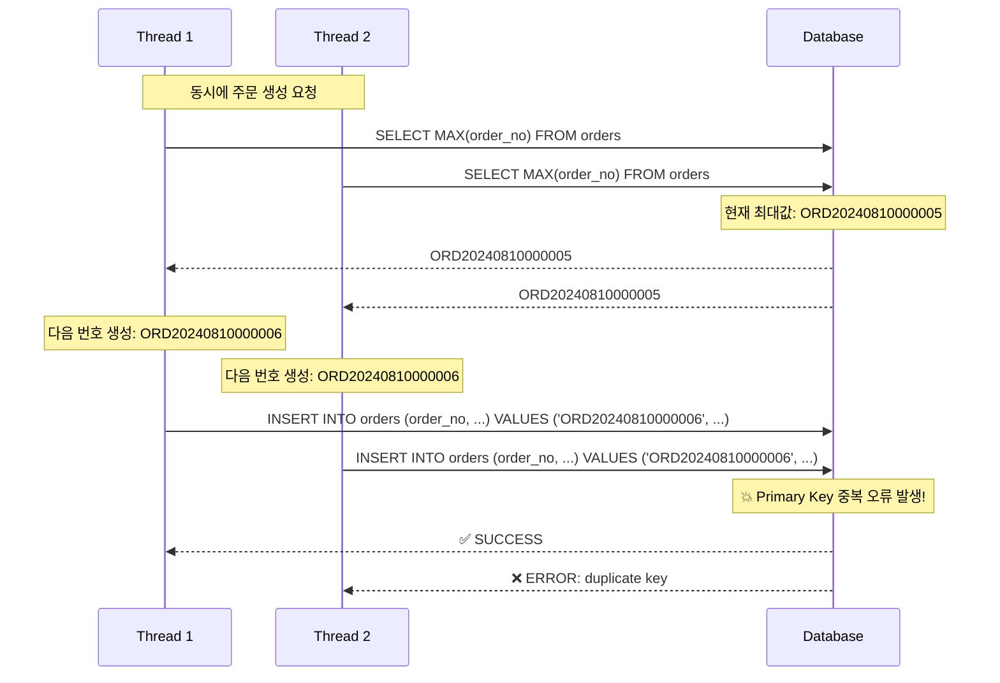
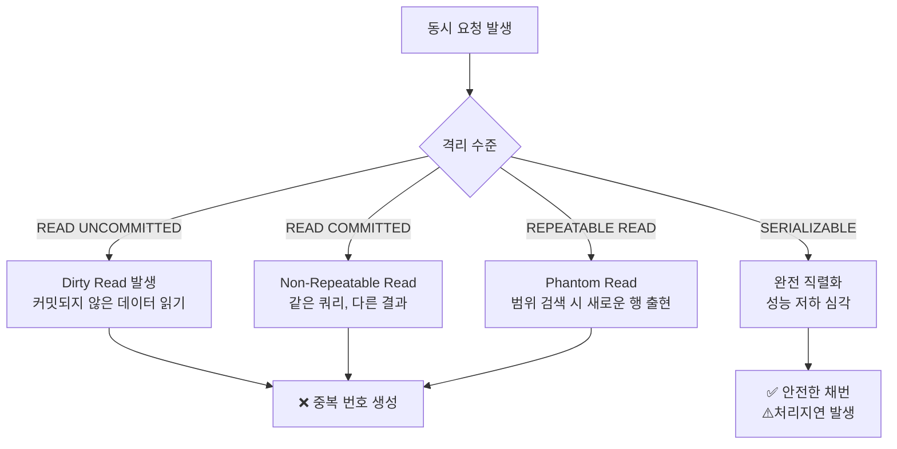
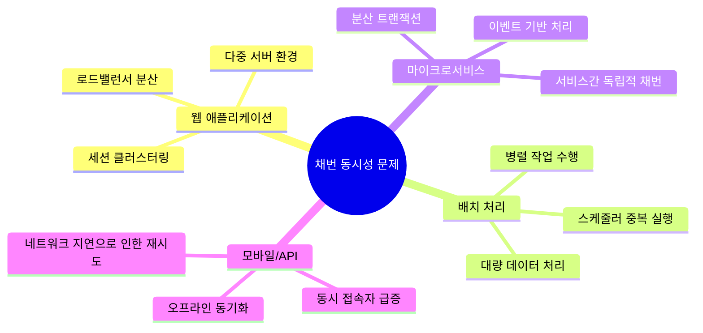

## 들어가며

멀티 스레드 환경에서 데이터베이스의 고유한 식별자를 생성할 때 동시성 문제로 인해 중복된 번호가 발생하거나 사용되지 않는 번호가 과도하게 채번되는 경험을 해보신 적이 있으신가요? 대량의 트랜잭션이 발생하는 시스템에서는 채번 로직의 원자성이 보장되지 않으면 데이터 무결성에 심각한 문제가 발생할 수 있습니다.

본 문서는 Spring Framework(Boot)환경에서 Oracle 데이터베이스와 Mybatis를 사용하여 **추가적인 자원 투입 없이(Redis를 이용한 분산 락 적용 등) 동시성이 보장되는 안전한 채번 로직을 구현**하는 다양한 방법들을 탐구하고 분석한 과정을 담고 있습니다.

각 방법의 장점과 단점을 분석하고 실제 구현 예시를 통해 조직과 시스템의 상황에 맞는 최적의 채번 전략을 선택하는데 도움이 되었으면 하는 바람으로 본 문서를 작성하게 되었습니다.

## 문제의 원인은 무엇일까?

일반적으로 많은 레거시 시스템에서 채번 로직을 구현할 때 다음과 같은 방식을 사용합니다.

```java
@Service
public class OrderService {

    @Autowired
    private OrderMapper orderMapper;

    @Transactional
    public void createOrder(OrderDto orderDto) {
        // 1. 현재 최대 번호 조회
        String maxOrderNo = orderMapper.selectMaxOrderNo();

        // 2. 다음 번호 생성
        String nextOrderNo = generateNextOrderNo(maxOrderNo);

        // 3. 주문 생성
        orderDto.setOrderNo(nextOrderNo);
        orderMapper.insertOrder(orderDto);
    }
}
```

언뜻 보면 문제없어 보이는 코드이지만, 동시에 여러 스레드가 같은 메서드를 호출하는 상황에서는 치명적인 문제가 발생할 수 있습니다.

### **Race Condition의 발생**

두 개의 스레드가 동시에 `selectMaxOrderNo()`를 호출하면 동일한 최대값을 반환받게 되고, 결과적으로 같은 주문번호가 생성되어 **Primary Key 제약 조건 위반이나 비즈니스 로직 오류가 발생**하게 됩니다.

이러한 문제는 단순히 `@Transactional` 어노테이션만으로는 해결되지 않습니다. 왜냐하면 각각의 트랜잭션이 격리되어 실행되기 때문에 **서로 다른 트랜잭션에서 수행되는 SELECT 작업은 동일한 결과를 반환**할 수 있기 때문입니다.

### **Race Condition 발생 시나리오**

동시성 문제가 어떻게 발생하는지 구체적인 시나리오를 통해 살펴보겠습니다.



동시에 두 건의 주문이 생성되는 상황을 가정했을 때, 프로그램은 각 각의 컨텍스트에서 채번을 진행하게 되며 이때, **채번 후 값이 갱신되지 않은 상태이기에 중복된 값을 채번**하게 됩니다.

주문번호의 갱신 시점까지는 오류가 발생하지 않겠지만, 주문내역을 입력하는 순간 **먼저 처리된 트랜잭션에 의해 1건의 주문이 먼저 등록**되게 되며, 이후 주문 건의 경우 **동일한 주문번호를 Primary Key로 가졌기에 무결성 제약조건으로 인해 오류가 발생**하여 트랜잭션의 롤백이 실행되게 됩니다.

### **트랜잭션 격리 수준별 문제 발생 양상**



그렇다면 이러한 채번 로직을 사용하는 경우에는 모두 같은 Race Condtion이 발생한다고 봐도 될까요? 정답은 ***“격리수준에 따라 발생할 수도, 발생하지 않을 수도 있고, 심지어는 Race Condition이 발생하더라도, 세부 적인 원인은 다를 수 있다”*** 입니다.

위 Race Condition의 예시는 저희가 사용하고 있는 Oracle의 기본 설정에서의 예시로, `READ COMMITED` 트랜잭션을 기본 격리 수준으로 가지는 상황에서 동일한 쿼리가 다른 결과를 낳을 수 있는 상황을 보여주고 있습니다.

허나, 실제 서비스 운영 환경에서는 다양한 종류의 DBMS를 사용하게 되고, 각 각의 DBMS는 서로 다른 기본 트랜잭션 설정을 가지고 있기에 채번과 같이 Race Condition이 발생할 가능성이 있는 기능의 경우 꼭 사용하고 있는 DBMS의 특성을 인지한 후 업무를 진행하여야 합니다.

### **데이터베이스 격리 수준의 한계**

대부분의 데이터베이스는 기본값으로 `READ COMMITTED` 격리 수준을 사용(MySQL은 기본값으로 `READ UNCOMMITED`를 사용)하는데, 이는 **커밋 되지 않은 데이터는 읽지 않지만 동시에 실행되는 SELECT 문이 같은 결과를 반환하는 것을 막지는 못합니다.**

물론 `SERIALIZABLE`을 격리 수준으로 채택할 경우 완전 직렬화로 안전한 채번이 가능하지만, **온라인 서비스에서 사용하기에는 너무 심각한 성능 저하가 발생할 우려**가 있어 SQLite와 같이 로컬 환경을 중심으로 하는 DB를 제외하고는 기본 격리 수준으로 채택하고 있지 않으며, **특수한 경우에 한해 적용하는 것을 권장**하고 있습니다.

### **실제 발생 가능한 문제 상황들**

채번 로직과 트랜잭션 격리 수준의 한계는 실제 서비스를 운영 시 생각보다 많은 곳에서 문제를 발생 시킬 가능성을 가지고 있습니다.



모놀리식 시스템의 경우 문제 발생 가능성이 낮은 편이지만, 서비스를 확장하기 위해 다채널 인터페이스를 시도하는 경우, 마이크로 서비스 아키텍처로의 전환을 진행하고 있는 경우에는 상대적으로 문제가 발생할 가능성이 높아집니다.

때문에 비즈니스 로직 내 이러한 기능이 존재한다면, **서비스 배포 전 전반적인 점검과 테스트 수행이 필요**하며 이 과정을 거쳐 가급적 **안전한 채번 방식으로의 전환하는 것을 권장**합니다.

## 어떻게 해결할 수 있을까?
채번 로직의 구현과 트랜잭션 수준의 한계로 인해 발생할 수 있는 상황을 이해했고, 서비스 운영 단계에서 문제가 될 수 있다는 것은 분명히 인식했는데, 그렇다면 어떤 방식으로 이 문제를 해결해야 할까요?

문제의 해결 방법은 **사용하고 있는 프레임워크, DB의 종류, SQL Mapper(JPA 구현체) 등에 따라 상이**할 수 있습니다. 앞으로 설명드릴 방법들은 제가 현재 사용하고 있는 `Spring Framework(Boot)`, `Oracle`, `Mybatis`를 기준으로 구현하고 테스트해본 방법들 입니다.

저와 같이 채번 로직에서 동시성 문제를 겪고 계시지만 다른 프레임워크 혹은 DB에서 작업을 진행하시는 경우 아래 방법들의 **한계점과 Trade-Off를 확인하신 후 시스템의 구성과 조직의 환경에 맞춰 상황에 맞는 적절한 해결책을 찾아보시는 걸 권장**드립니다.

## 방법 1. Sequence + 채번 Function
Oracle 데이터베이스의 Sequence를 활용하는 방법은 가장 안전하고 성능이 뛰어난 채번 방식 중 하나 입니다.

### **Sequence 생성**
```sql
-- 주문번호용 시퀀스 생성
CREATE SEQUENCE SEQ_ORDER_NO
START WITH 1
INCREMENT BY 1
NOCACHE
NOCYCLE;
```

### **채번 Function 구현**
```sql
CREATE OR REPLACE FUNCTION FN_GET_ORDER_NO
RETURN VARCHAR2
IS
    v_seq_no NUMBER;
    v_order_no VARCHAR2(20);
BEGIN
    -- 시퀀스에서 다음 값 가져오기
    SELECT SEQ_ORDER_NO.NEXTVAL INTO v_seq_no FROM DUAL;

    -- 비즈니스 룰에 맞는 형태로 변환
    v_order_no := 'ORD' || TO_CHAR(SYSDATE, 'YYYYMMDD') ||
                  LPAD(v_seq_no, 6, '0');

    RETURN v_order_no;
END;
/

```

### **Mybatis Mapper 구현**
```xml
<select id="getNextOrderNo" resultType="string">
    SELECT FN_GET_ORDER_NO() FROM DUAL
</select>

<insert id="insertOrder" parameterType="OrderDto">
    INSERT INTO TB_ORDER (
        ORDER_NO, CUSTOMER_ID, ORDER_DATE, AMOUNT
    ) VALUES (
        #{orderNo}, #{customerId}, SYSDATE, #{amount}
    )
</insert>

```

### **Service 구현**
```java
@Service
public class OrderService {

    @Autowired
    private OrderMapper orderMapper;

    @Transactional
    public void createOrder(OrderDto orderDto) {
        // 원자성이 보장되는 채번
        String orderNo = orderMapper.getNextOrderNo();

        orderDto.setOrderNo(orderNo);
        orderMapper.insertOrder(orderDto);
    }
}

```

### 장점 및 단점
**장점**
- Oracle Sequence의 원자성 보장으로 **동시성 문제 완전 해결**
- 메모리 기반 연산으로 **높은 성능을 보장**
- 데이터베이스 수준에서 관리되므로 **안정성 우수**

**단점**
- 복잡한 채번 규칙 적용 시 **별도의 Function 개발 필요**
- 채번 만료를 대비한 **순환 규칙 설정 등 별도의 관리 필요**
- 트랜잭션 롤백 시 **결번(번호 건너뛰기) 현상 발생 가능**

## 방법 2. Select + For Update 문으로 행 잠그기
비즈니스 로직이 복잡하여 Sequence만으로는 해결이 어려운 경우, 레코드 수준 잠금을 활용하는 방법입니다.

### **채번 테이블 설계**
```sql
-- 채번 관리 테이블
CREATE TABLE TB_NUMBER_GENERATOR (
    TABLE_NAME VARCHAR2(50) PRIMARY KEY,
    CURRENT_NO NUMBER(10) DEFAULT 0,
    PREFIX VARCHAR2(10),
    UPDATE_DATE DATE DEFAULT SYSDATE
);

-- 초기 데이터 입력
INSERT INTO TB_NUMBER_GENERATOR
VALUES ('TB_ORDER', 0, 'ORD', SYSDATE);

```

### **Mybatis Mapper 구현**
```xml
<!-- 현재 번호 조회 및 잠금 -->
<select id="selectCurrentNoForUpdate" parameterType="string" resultType="int">
    SELECT CURRENT_NO
    FROM TB_NUMBER_GENERATOR
    WHERE TABLE_NAME = #{tableName}
    FOR UPDATE NOWAIT
</select>

<!-- 다음 번호로 업데이트 -->
<update id="updateNextNo" parameterType="map">
    UPDATE TB_NUMBER_GENERATOR
    SET CURRENT_NO = #{nextNo},
        UPDATE_DATE = SYSDATE
    WHERE TABLE_NAME = #{tableName}
</update>

<insert id="insertOrder" parameterType="OrderDto">
    INSERT INTO TB_ORDER (
        ORDER_NO, CUSTOMER_ID, ORDER_DATE, AMOUNT
    ) VALUES (
        #{orderNo}, #{customerId}, SYSDATE, #{amount}
    )
</insert>

```

### **Service 구현**
```java
@Service
public class OrderService {

    @Autowired
    private OrderMapper orderMapper;

    @Transactional
    public void createOrder(OrderDto orderDto) {
        try {
            // 1. 현재 번호 조회 및 행 잠금
            int currentNo = orderMapper.selectCurrentNoForUpdate("TB_ORDER");

            // 2. 다음 번호 생성
            int nextNo = currentNo + 1;
            String orderNo = "ORD" + LocalDate.now().format(DateTimeFormatter.ofPattern("yyyyMMdd"))
                           + String.format("%06d", nextNo);

            // 3. 채번 테이블 업데이트
            Map<String, Object> paramMap = new HashMap<>();
            paramMap.put("tableName", "TB_ORDER");
            paramMap.put("nextNo", nextNo);
            orderMapper.updateNextNo(paramMap);

            // 4. 주문 생성
            orderDto.setOrderNo(orderNo);
            orderMapper.insertOrder(orderDto);

        } catch (Exception e) {
            throw new RuntimeException("주문 생성 중 오류가 발생했습니다: " + e.getMessage());
        }
    }
}

```


**장점**
- **복잡한 비즈니스 룰** 적용 가능
- 번호 연속성 보, **결번 문제 없음**
- 기존 시스템에 중요 **변경사항(스키마 변경, 서비스 동작방식 변경) 없이 적용 가능**


**단점**
- 동시성 처리 시 **대기 시간 발생** 가능성 존재
- **데드락(DeadLock)** 발생 위험성 존재
- 실행 빈도가 높은 서비스에 적용 시 **필연적인 성능 저하 발생**

Select + For Update를 이용한 비관적 락의 경우 데이터베이스에서 동시성을 제어할 수 있는 가장 강력한 도구 중 하나입니다.

다만, 락이 설정된 동안은 다른 트랜잭션이 해당 행(레코드)에 대한 갱신 작업을 할 수 없기에 **필연적인 성능 저하가 동반**되며, 비즈니스 로직의 동작 순서에 따라 **자원 교착(Deadlock)이 발생**할 수도 있습니다.

이 방식은 쿼리의 작성에서는 큰 변경사항이 발생하지 않지만, 교착이 발생하는 상황을 방지하기 위해 해당 테이블을 갱신하는 작업이 추가적으로 없는지 확인하여야 하며, 많은 서비스의 이해 관계가 얽혀있을 경우 예외 처리를 통한 교착 방지와 동작 보장을 위한 **재처리 로직 구현에 더 많은 수고가 필요**할 수 있습니다.

이러한 특성을 가졌기에 고객의 잔고 등을 **갱신하는 순서가 중요하고, 그 빈도가 높지 않은 서비스에 적용**하는 것을 고려해볼만 하며, 순서 보다는 처리가 중요하고, 발생 빈도가 높은 서비스에서는 원자성 보장으로 인해 얻을 수 있는 이득보다 성능적 손실이 크기에 적용에 대한 많은 검토가 필요합니다.

## 방법 3. selectKey를 이용해 Merge, Select를 한 트랜잭션에 실행하기

Mybatis의 `<selectKey>` 기능을 활용하여 채번과 동시에 INSERT를 수행하는 방법입니다.

### **채번 로직이 포함된 Mapper**
```xml
<insert id="insertOrderWithSelectKey" parameterType="OrderDto">
    <selectKey keyProperty="orderNo" resultType="string" order="BEFORE">
        MERGE INTO TB_NUMBER_GENERATOR T1
        USING (SELECT 'TB_ORDER' AS TABLE_NAME FROM DUAL) T2
        ON (T1.TABLE_NAME = T2.TABLE_NAME)
        WHEN MATCHED THEN
            UPDATE SET CURRENT_NO = CURRENT_NO + 1,
                      UPDATE_DATE = SYSDATE
        WHEN NOT MATCHED THEN
            INSERT (TABLE_NAME, CURRENT_NO, PREFIX, UPDATE_DATE)
            VALUES ('TB_ORDER', 1, 'ORD', SYSDATE);

        SELECT 'ORD' || TO_CHAR(SYSDATE, 'YYYYMMDD') ||
               LPAD(CURRENT_NO, 6, '0') AS ORDER_NO
        FROM TB_NUMBER_GENERATOR
        WHERE TABLE_NAME = 'TB_ORDER'
    </selectKey>

    INSERT INTO TB_ORDER (
        ORDER_NO, CUSTOMER_ID, ORDER_DATE, AMOUNT
    ) VALUES (
        #{orderNo}, #{customerId}, SYSDATE, #{amount}
    )
</insert>
```

### **Service 구현**
```java
@Service
public class OrderService {

    @Autowired
    private OrderMapper orderMapper;

    @Transactional
    public void createOrder(OrderDto orderDto) {
        // selectKey에서 자동으로 orderNo가 설정됨
        orderMapper.insertOrderWithSelectKey(orderDto);

        // 생성된 주문번호 확인
        System.out.println("생성된 주문번호: " + orderDto.getOrderNo());
    }
}
```


**장점**
- 단일 SQL문으로 채번과 INSERT 동시 처리
- Mybatis 기능을 활용한 간단한 구현
- 트랜잭션 범위 내에서 원자성 보장

**단점**
- MERGE 문의 복잡성
- 일부 데이터베이스에서 성능 이슈 발생 가능
- 디버깅 및 유지보수 어려움

SelectKey 구문은 **자동 생성 키 컬럼을 지원하지 않는 데이터베이스를 위해 `Mybatis`에서 제공하는 채번 로직**입니다. 실행하고자 하는 `INSERT`, `UPDATE` 문과 함께 실행되며, 본 쿼리의 실행 전 채번을 진행하거나, 쿼리 실행이 완료된 후 결과값에 대한 채번을 지원하고 있습니다.

허나, 쿼리 매핑내역 내 항상 포함되어야 하는 단점으로 인해 **쿼리의 반복부가 늘어나고, 로직의 변경을 일관적으로 반영할 수 없다는 치명적인 단점**을 가지고 있기에 공통 채번을 사용하지 않고, 개별 테이블에 대한 채번만을 진행해야 하는 상황에 한해 사용하는 것을 권장 드립니다.

## 방법 4. 낙관적 락(Optimistic Lock)을 활용한 채번

대용량 트래픽 상황에서 행 잠금으로 인한 **성능 저하를 피하면서도 동시성을 제어할 수 있는 방법**입니다.

### **버전 관리 테이블 설계**
```sql
-- 낙관적 락을 위한 채번 테이블
CREATE TABLE TB_NUMBER_GENERATOR (
    TABLE_NAME VARCHAR2(50) PRIMARY KEY,
    CURRENT_NO NUMBER(10) DEFAULT 0,
    PREFIX VARCHAR2(10),
    VERSION NUMBER(10) DEFAULT 1,  -- 낙관적 락용 버전 컬럼
    UPDATE_DATE DATE DEFAULT SYSDATE
);

-- 초기 데이터 입력
INSERT INTO TB_NUMBER_GENERATOR
VALUES ('TB_ORDER', 0, 'ORD', 1, SYSDATE);

```

### **Mybatis Mapper 구현**
```xml
<!-- 현재 번호와 버전 조회 -->
<select id="selectCurrentNoWithVersion" parameterType="string" resultType="NumberGeneratorDto">
    SELECT TABLE_NAME as tableName,
           CURRENT_NO as currentNo,
           PREFIX as prefix,
           VERSION as version
    FROM TB_NUMBER_GENERATOR
    WHERE TABLE_NAME = #{tableName}
</select>

<!-- 낙관적 락을 이용한 업데이트 -->
<update id="updateNextNoWithOptimisticLock" parameterType="NumberGeneratorDto">
    UPDATE TB_NUMBER_GENERATOR
    SET CURRENT_NO = #{currentNo},
        VERSION = VERSION + 1,
        UPDATE_DATE = SYSDATE
    WHERE TABLE_NAME = #{tableName}
      AND VERSION = #{version}
</update>

<insert id="insertOrder" parameterType="OrderDto">
    INSERT INTO TB_ORDER (
        ORDER_NO, CUSTOMER_ID, ORDER_DATE, AMOUNT
    ) VALUES (
        #{orderNo}, #{customerId}, SYSDATE, #{amount}
    )
</insert>

```

### **DTO 클래스**
```java
public class NumberGeneratorDto {
    private String tableName;
    private int currentNo;
    private String prefix;
    private int version;

    // getter, setter 생략
}
```

### **Service 구현 (재시도 로직 포함)**
```java
@Service
public class OrderService {

    @Autowired
    private OrderMapper orderMapper;

    private static final int MAX_RETRY_COUNT = 5;
    private static final long RETRY_DELAY_MS = 10;

    @Transactional
    public void createOrder(OrderDto orderDto) {
        String orderNo = generateOrderNoWithOptimisticLock();

        orderDto.setOrderNo(orderNo);
        orderMapper.insertOrder(orderDto);
    }

    private String generateOrderNoWithOptimisticLock() {
        for (int attempt = 1; attempt <= MAX_RETRY_COUNT; attempt++) {
            try {
                // 1. 현재 번호와 버전 조회
                NumberGeneratorDto generator = orderMapper.selectCurrentNoWithVersion("TB_ORDER");

                // 2. 다음 번호 생성
                int nextNo = generator.getCurrentNo() + 1;
                String orderNo = generator.getPrefix() +
                               LocalDate.now().format(DateTimeFormatter.ofPattern("yyyyMMdd")) +
                               String.format("%06d", nextNo);

                // 3. 낙관적 락으로 업데이트 시도
                generator.setCurrentNo(nextNo);
                int updatedRows = orderMapper.updateNextNoWithOptimisticLock(generator);

                if (updatedRows == 1) {
                    // 성공적으로 업데이트됨
                    return orderNo;
                } else {
                    // 다른 스레드에서 먼저 업데이트함 - 재시도 필요
                    if (attempt < MAX_RETRY_COUNT) {
                        Thread.sleep(RETRY_DELAY_MS * attempt); // 지수 백오프
                        continue;
                    } else {
                        throw new RuntimeException("채번 생성 최대 재시도 횟수 초과");
                    }
                }

            } catch (InterruptedException e) {
                Thread.currentThread().interrupt();
                throw new RuntimeException("채번 생성 중 인터럽트 발생", e);
            } catch (Exception e) {
                throw new RuntimeException("채번 생성 중 오류 발생: " + e.getMessage(), e);
            }
        }

        throw new RuntimeException("채번 생성 실패");
    }
}

```

**장점**
- 성능 저하 없이 동시성 제어 가능
- 높은 처리량과 확장성
- 자원 교착 발생 위험 없음
- 분산 환경에서도 적용 가능

**단점**
- 충돌 발생 시 **재시도 로직 필요**
- 높은 경합 상황에서 성능 저하 가능
- 구현 복잡도 증가

낙관적 락은 비관적 락과 달리 레코드에 대한 **잠금 없이 현재의 상태를 기준으로 대상 레코드를 검증해 원자성을 확보하는 방식**입니다.

기본적으로 **동시성에 의한 불일치를 가정**하고 사용하는 락으로 **재시도 로직 등을 사용하여 서비스의 동작을 보장**하는 방법으로 사용합니다.

레코드에 대한 잠금을 수행하지 않는 만큼 **자원 교착 발생 위험이 없고**, **높은 처리량과 확장성을 보장**하나, **충돌 방지를 위한 재시도 로직의 구현이 강제**되고, 높은 경합 상황에서는 과도한 재시도로 인해 오히려 처리량을 저하시킬 수 있습니다.

발생 빈도는 높으나, **재시도에 많은 자원이 필요하지 않고 실패를 어느정도 허용할 수 있는 서비스가 존재할 경우 적용을 고려**해보시는 것을 추천합니다.

## 방법 5. Merge + Returning 프로시저 사용하기
Oracle의 `MERGE` + `RETURNING` 절을 활용하여 갱신된 채번 값을 즉시 반환받는 방법입니다.

**프로시저 생성**
```sql
CCREATE OR REPLACE PROCEDURE SP_GET_NEXT_ORDER_NO (
    P_TABLE_NAME IN VARCHAR2,
    P_ORDER_NO OUT VARCHAR2
)
IS
    v_current_no NUMBER;        -- MERGE 후 반환받을 현재 번호
    v_date_str VARCHAR2(8);     -- 날짜 문자열 (YYYYMMDD)
BEGIN
    -- 현재 날짜를 문자열로 변환
    v_date_str := TO_CHAR(SYSDATE, 'YYYYMMDD');
    
    -- MERGE와 RETURNING을 조합하여 원자적 연산 수행
    MERGE INTO TB_NUMBER_GENERATOR T1
    USING (SELECT P_TABLE_NAME AS TABLE_NAME FROM DUAL) T2
    ON (T1.TABLE_NAME = T2.TABLE_NAME)
    WHEN MATCHED THEN
        UPDATE SET 
            CURRENT_NO = CURRENT_NO + 1,
            UPDATE_DATE = SYSDATE
    WHEN NOT MATCHED THEN
        INSERT (TABLE_NAME, CURRENT_NO, PREFIX, UPDATE_DATE)
        VALUES (P_TABLE_NAME, 1, 'ORD', SYSDATE)
    -- RETURNING 절로 업데이트/삽입된 CURRENT_NO 값을 즉시 반환
    RETURNING CURRENT_NO INTO v_current_no;
    
    -- 비즈니스 룰에 맞는 형태로 변환
    -- 형식: ORD + YYYYMMDD + 6자리 순번
    P_ORDER_NO := 'ORD' || v_date_str || LPAD(v_current_no, 6, '0');
    
    -- 명시적 커밋 없음 (호출하는 트랜잭션에서 관리)
EXCEPTION
    WHEN OTHERS THEN
        -- 오류 발생 시 상세 정보와 함께 예외 재발생
        RAISE_APPLICATION_ERROR(-20001, 
            '채번 생성 중 오류 발생: ' || SQLERRM);
END;
/

```

**Mybatis Mapper 구현**
```xml
<select id="getNextOrderNoByProcedure" statementType="CALLABLE" parameterType="map">
    {CALL SP_GET_NEXT_ORDER_NO(
        #{tableName, mode=IN, jdbcType=VARCHAR},
        #{orderNo, mode=OUT, jdbcType=VARCHAR}
    )}
</select>

<insert id="insertOrder" parameterType="OrderDto">
    INSERT INTO TB_ORDER (
        ORDER_NO, CUSTOMER_ID, ORDER_DATE, AMOUNT
    ) VALUES (
        #{orderNo}, #{customerId}, SYSDATE, #{amount}
    )
</insert>

```

**Service 구현**
```java
@Service
public class OrderService {
    
    @Autowired
    private OrderMapper orderMapper;
    
    @Transactional
    public void createOrder(OrderDto orderDto) {
        // 프로시저 호출용 파라미터 준비
        Map<String, Object> paramMap = new HashMap<>();
        paramMap.put("tableName", "TB_ORDER");
        
        // 프로시저 호출로 다음 번호 생성
        // MERGE + RETURNING으로 원자적 채번 수행
        orderMapper.getNextOrderNoByProcedure(paramMap);
        
        // OUT 파라미터에서 생성된 번호 추출
        String orderNo = (String) paramMap.get("orderNo");
        
        // 주문 생성 (프로시저와 동일한 트랜잭션에서 처리)
        orderDto.setOrderNo(orderNo);
        orderMapper.insertOrder(orderDto);
        
        // 트랜잭션 커밋/롤백은 Spring이 관리
        // 오류 발생 시 채번도 함께 롤백됨
    }
}
```

**장점**
- 데이터베이스 레벨에서 **완전한 원자성 보장**
- **복잡한 비즈니스 로직** 구현 가능
- 높은 성능과 안정성

**단점**
- 프로시저 개발 및 **유지보수 부담**
- **데이터베이스 종속적**인 구현
- 애플리케이션 로직과 분리되어 **관리 복잡성 증가**

**`MERGE` + `RETURNING` 방식은 Oracle에서만 사용 가능하다는 한계**가 존재하지만, 프로시저의 특성으로 인해 메모리에 캐싱되어 **사용자가 많은 환경일 수록 성능적 이점**을 가져올 수 있습니다.

이와 더불어 프로시저만 적절이 구현된다면 **재사용이 용이하고, 네트워크 라운드 트립을 줄일 수 있어** 서비스 코드 전반의 구현량을 줄이고 쿼리의 유지보수성 향상에도 도움을 줄 수 있다는 명확한 장점을 가지고 있습니다.

다만, 이 방식은 대부분의 상황에서 서비스에 종속된 트랜잭션과 원자적 연산의 특성으로 인해 **채번 당시에는 채번의 연속성을 보장할 수 있으나, 먼저 수행된 트랜잭션이 커밋에 실패하고, 거의 동시에 채번을 시작한 다른 트랜잭션이 커밋에 성공한 경우 결번이 발생**할 수 는 있습니다.

이는 트랜잭션의 일관성과 채번의 원자성 보장하기 위해 발생하는 **자연스러운 Trade-Off의 결과물**로 메인 비즈니스 로직에 직접적인 영향을 끼치지는 않습니다.

오히려, 이를 통해 처리 실패가 빈번히 발생하는 서비스를 식별해 낼 수 있으며, 이에 대한 적절한 로깅과 모니터링을 적용한다면 오히려 서비스의 안정성을 높일 수 있는 하나의 요소로 사용될 수 있습니다.

## 이 방법들은 정말 다른 방법보다 뛰어날까?
지금까지 채번 로직의 원자성을 보장하기 위한 다섯 가지의 방법을 살펴보았습니다.

모든 방법들을 직접 적용해보면서 채번의 원자성을 확실히 보장할 수 있는 방법들이라는 것을 확인할 수 있었습니다. 허나, 그와 동시에 하나의 의문도 가지게 되었습니다.

> ***“이론적으로 원자성을 보장하는 채번을 가능하게 하는 방법인건 알겠는데, 지금 당장 문제가 발생하지 않는 상황에서 구현을 변경할 정도로 뛰어난 해결책일까?”***

어찌보면 당연한 의문이라고 생각합니다. 가장 많이 사용하는 로직 중 하나인 채번 로직을 변경한다는 것은 **서비스를 운영하는 입장에서는 큰 부담**으로 작용합니다.

그런만큼 변경을 위해서는 **기존 방식 대비 장점이 명확**해야하고, 오**류 발생 가능성과 최악의 경우 원상복구를 고려**해야 했기에 이에 대한 우수성이 명확해야한다 생각했고, 이에 대한 분석을 진행하였습니다.

### **자율 트랜잭션(Autonomous Transaction) 방식 프로시저**
가장 먼저 살펴본 것은 기존 채번 로직에 많이 사용되고 있었던 자율 트랜잭션 방식의 `SELECT` + `UPDATE`로 구성된 프로시저 입니다.

```sql
-- ❌ 문제가 있는 기존 방식
CREATE OR REPLACE PROCEDURE SP_GET_ORDER_NO_AUTONOMOUS (
    P_ORDER_NO OUT VARCHAR2
)
IS
    PRAGMA AUTONOMOUS_TRANSACTION;  -- 독립적인 트랜잭션
    v_next_no NUMBER;
BEGIN
    SELECT CURRENT_NO + 1 INTO v_next_no
    FROM TB_NUMBER_GENERATOR
    WHERE TABLE_NAME = 'TB_ORDER'
    FOR UPDATE;

    UPDATE TB_NUMBER_GENERATOR
    SET CURRENT_NO = v_next_no
    WHERE TABLE_NAME = 'TB_ORDER';

    COMMIT;  -- 메인 트랜잭션과 별개로 커밋

    P_ORDER_NO := 'ORD' || TO_CHAR(SYSDATE, 'YYYYMMDD') ||
                  LPAD(v_next_no, 6, '0');
END;

```

자율 트랜잭션 방식은 **메인 트랜잭션과 별개로 어떤 상황에서도 채번이 보장**된다는 특징을 가지고 있었지만, 사실 채번이 진행되는 상황은 대부분 메인 트랜잭션의 동작에 의존적인 상황들이기에 채번만 수행된다고 해서 얻을 수 있는 장점은 거의 없었습니다.

이와 더불어 자율 트랜잭션 방식의 채번 프로시저를 사용할 경우 크게 두가지 문제가 발생할 가능성이 존재합니다.

첫째, **트랜잭션의 일관성이 파괴**될 수 있습니다. 프로시저의 동작상 메인 트랜잭션의 성공 여부와 관계없이 커밋이 진행되기에 채번 트랜잭션과 메인 트랜잭션과의 일관성이 파괴될 수 있습니다.

둘째, **대규모 결번이 발생할 가능성이 존재**합니다. 오프라인 결락자료의 전송이나 인터페이스 순단 직후 복구 과정에서 발생하는 **대규모 요청이 실패할 시 대량의 롤백이 발생**하는데 이 때 **대규모 결번이 발생**할 수 있으며, 이는 **연속적인 번호 체계를 파괴하고 채번의 소모를 가속**할 수 있습니다.

이러한 방식과 대비하여 본 문서에서 제시된 방법들은 항상 메인 트랜잭션과의 일관성을 보장하고, 후 처리 실패 등의 트랜잭션 롤백을 제외하면 결번이 거의 발생하지 않으므로, 기존 방식에 비해서는 확실한 이점을 가지고 있다는 것을 확인할 수 있었습니다.

### **애플리케이션 레벨 동기화 방식**
일부 시스템에서는 Java의 `synchronized`나 `ReentrantLock` 등 Mutex를 이용한 접근 제어를 통해 채번 로직의 원자성을 확보하기도 합니다.

```java
// ❌ 문제가 있는 애플리케이션 레벨 동기화
public class OrderService {
    private static final Object LOCK = new Object();

    public void createOrder(OrderDto orderDto) {
        synchronized(LOCK) {  // 애플리케이션 레벨 동기화
            String maxNo = orderMapper.selectMaxOrderNo();
            String nextNo = generateNextNo(maxNo);
            orderDto.setOrderNo(nextNo);
            orderMapper.insertOrder(orderDto);
        }
    }
}

```

애플리케이션 레벨의 동기화 방식은 **단일 서버를 운영하고, 싱글톤 패턴을 사용하는 경우 하나의 해결책**이 될 수 있으나, 실행되는 **애플리케이션 컨텍스트를 기준으로 동기화**를 진행한다는 특성으로 인해 다수의 서버를 운영하는 실제 운영환경에서는 채번 로직의 원자성을 보장하지 못할 수 있습니다.

이와 더불어 동기화 방식은 **모든 요청을 순차 처리하기에 필연적으로 성능 저하가 동반**되며 최악의 경우 기존 서비스 처리 방식 대비 처리 시간이 2배 이상 상승할 가능성 또한 존재합니다.

이에 비해 본 문서에서 제시된 방법은 대부분의 상황에서 애플리케이션 레벨 동기화 방식에 비해 성능적 우위가 분명히 나타나기에 도입에 충분한 이점이 있다는 것을 확인할 수 있었습니다.

### **Redis 기반 분산 락 방식**
Redis 기반의 분산 락은 최근 가장 많이 사용되고 있는 동시성 관리 방법 중 하나입니다.

```java
// Redis 분산 락 방식의 복잡성
@RedissonClient
public void createOrderWithDistributedLock(OrderDto orderDto) {
    RLock lock = redissonClient.getLock("order-number-lock");
    try {
        if (lock.tryLock(10, 30, TimeUnit.SECONDS)) {
            // 채번 로직
        } else {
            throw new RuntimeException("락 획득 실패");
        }
    } finally {
        if (lock.isLocked() && lock.isHeldByCurrentThread()) {
            lock.unlock();
        }
    }
}
```

Redis의 경우 기존의 RDBMS들과 달리 메모리를 기반으로 동작하는 DB로 **기존 방식들 대비 월등한 처리속도를 제공하며, 분산 환경에서 최적화된 락을 지원**하고 있습니다.

이와 더불어 TTL 관리로 클라이언트의 예상치 못한 작업 중단 등에 대비할 수 있으며, 상대적으로 적은 자원을 소모한다는 장점 또한 가지고 있습니다.

허나, 기본적으로 **Redis에 의존하는 동시성 제어 방식으로 Redis 클러스터의 구성이 강제**되고, 클러스터 자체가 단일 장애점이 될 수 있다는 단점을 가지고 있으며, **정확한 오류의 추적 등을 위해서는 기존의 DB 운영 체계 이외의 별도 모니터링 방안**을 마련해야 하는 등의 추가 요건을 가지고 있습니다.

다만, **단점을 모두 상쇄할 만큼의 성능적 이점**을 가지고 있기에 분산 환경에 대한 경험이 충분하고, 인프라에 대한 구성이 자체적으로 가능한 조직이라면 가급적 이 방식을 채택하는 것을 권장합니다.

분산 락의 경우 **RDBMS에서 실행할 수 있는 방식에 비해 원자성을 완전히 보장할 수 없는 방식**이기에 금융시스템과 같이 데이터의 정합성이 최우선이 되는 시스템에서는 이 방법을 채택하는 것을 권하지 않습니다.

또한, **본 문서는 추가적인 자원 투입이 불가한 상태에서 최소한의 노력으로 채번 로직을 안정화한다는 목적**을 가지고 있고, 분산 락 적용을 위해서는 Redis 클러스터를 구성하고 기존의 로직을 대부분 수정해야하는 등 많은 노력과 위험이 존재하기에 **적용 고려대상에서는 제외**하였습니다.

### **UUID(Universally Unique Identifier) 방식**
UUID는 전 세계적으로 유일한 식별자를 생성하기 위한 표준으로 32개의 16진수를 5개의 하이픈(-)으로 구분하여 나눈 형식으로 구성됩니다.

```java
// UUID 방식의 한계
String orderNo = UUID.randomUUID().toString(); // "a1b2c3d4-e5f6-7890-abcd-ef1234567890"

```

UUID(혹은, GUID) 방식의 경우 타임스탬프, 클럭 시퀀스, 노드ID 등을 사용하기에 **완벽에 가까운 유일성을 보장한다는 장점**을 가지고 있습니다.

다만, 채번 시 날짜, 순번 등의 **의미 있는 정보가 필요하거나, 정렬이 필요한 경우 사용할 수 없다는 단점이 존재**하고, 길이가 32개 문자(128비트)로 고정되어 있어 **테이블스페이스 가용량이 빠르게 소모**되고, **인덱스 효율성이 저하**된다는 단점을 가지고 있습니다.

이 방식의 경우 단일 식별자로 사용되기에는 적합하나, 채번과 같이 의미성이 부여되어야 하고, 정렬 등을 통해 순번을 보장할 수 있어야 하는 경우에 적합하지 못해 본 문서에서 언급하는 상황에는 적합하지 못함을 확인할 수 있었습니다.

## 결론

지금까지 Spring Framework(Boot), Oracle, Mybatis 환경에서 채번의 원자성을 보장하기 위한 방법들을 살펴보고 각 각의 장단점을 분석해보았습니다.

### **채번 방식별 상세 비교표**

| 구분            | Sequence + Function | Select + For Update | selectKey + Merge | 낙관적 락 | Merge + Returning 프로시저 |
| ------------- | ------------------- | ------------------- | ----------------- | ----- | ---------------------- |
| **성능**        | ⭐⭐⭐⭐⭐               | ⭐⭐⭐                 | ⭐⭐⭐               | ⭐⭐⭐⭐  | ⭐⭐⭐⭐                   |
| **동시성 처리**    | ⭐⭐⭐⭐⭐               | ⭐⭐⭐                 | ⭐⭐⭐⭐              | ⭐⭐⭐⭐  | ⭐⭐⭐⭐⭐                  |
| **번호 연속성**    | ⭐⭐                  | ⭐⭐⭐⭐⭐               | ⭐⭐⭐⭐              | ⭐⭐⭐⭐⭐ | ⭐⭐⭐⭐                   |
| **구현 복잡도**    | ⭐⭐                  | ⭐⭐⭐                 | ⭐⭐⭐               | ⭐     | ⭐⭐⭐                    |
| **비즈니스 룰 적용** | ⭐⭐⭐                 | ⭐⭐⭐⭐⭐               | ⭐⭐⭐               | ⭐⭐⭐⭐⭐ | ⭐⭐⭐⭐⭐                  |
| **데드락 위험**    | ⭐⭐⭐⭐⭐               | ⭐⭐                  | ⭐⭐⭐               | ⭐⭐⭐⭐⭐ | ⭐⭐⭐                    |
| **확장성**       | ⭐⭐⭐⭐⭐               | ⭐⭐                  | ⭐⭐⭐               | ⭐⭐⭐⭐⭐ | ⭐⭐⭐⭐                   |
| **유지보수성**     | ⭐⭐⭐⭐                | ⭐⭐⭐⭐                | ⭐⭐⭐               | ⭐⭐    | ⭐⭐                     |
| **DB 종속성**    | ⭐⭐                  | ⭐⭐⭐⭐⭐               | ⭐⭐⭐               | ⭐⭐⭐⭐⭐ | ⭐⭐                     |

### **상황별 권장사항**

본 문서에서 탐구한 방법들은 모두 각 각 다른 장/단점을 가지고 있기에 **무조건 하나의 방법을 고집하기 보다는 현재 처한 상황에 따라 어느 방법이 좋을지를 판단하고 적용**해보시기 바랍니다

아래 내용은 언급한 방법들을 사용해보고 실제 어떤 경우에 적용하는 것이 좋을 지를 상황에 따라 일반화 해본 것으로 **세부적인 적용은 실제 운영 환경과 소스코드 표준, 조직의 기술적 성숙도 등을 고려하여 적용**하는 것을 권장드립니다.

1. **성능과 안정성을 최우선으로 한다면: 방법 1 (Sequence + Function)**
```
✅ 대용량 트랜잭션 처리
✅ 높은 동시성 요구사항
✅ Oracle 환경 고정
❌ 복잡한 채번 룰
```

2. **복잡한 비즈니스 룰이 필요하다면: 방법 5 (Merge + Returning 프로시저)**
```
✅ 복잡한 채번 로직
✅ 데이터 정합성 중요
✅ Oracle 환경 고정
❌ 크로스 플랫폼 요구사항
```

3. **높은 처리량과 확장성이 중요하다면: 방법 4 (낙관적 락)**
```
✅ 분산 환경
✅ 마이크로서비스 아키텍처
✅ 클라우드 환경
❌ 구현 복잡도 우려
```

4. **기존 시스템에 빠르게 적용해야 한다면: 방법 2 (Select + For Update)**
```
✅ 레거시 시스템 개선
✅ 최소한의 구조 변경
✅ 단순한 요구사항
❌ 높은 동시성 요구
```

5. **Mybatis 기능을 최대한 활용하고 싶다면: 방법 3 (selectKey + Merge)**
```
✅ 중간 수준의 요구사항
✅ 기존 Mybatis 활용
✅ 적당한 성능 요구
❌ 최고 성능 요구
```

### **공통 주의사항**

1. **충분한 테스트 수행**: 선택한 방법에 대해 동시성 테스트와 부하 테스트를 반드시 수행하세요.
2. **모니터링 체계 구축**: 채번 실패율, 응답시간, 리소스 사용량에 대한 모니터링을 설정하세요.
3. **백업 전략 수립**: 채번 테이블이나 시퀀스에 대한 백업 및 복구 전략을 미리 수립하세요.
4. **에러 핸들링**: 각 방식별 예외 상황에 대한 적절한 에러 핸들링과 알림 체계를 구축하세요.

## 마치며

처음에는 “모든 상황에서 가장 적합한 방법을 찾아 해결책으로 제시하자!”라는 마음가짐으로 임했지만, “은 탄환은 없다"라는 말 처럼 **모든 상황에 완벽하게 맞는 정답은 존재하지 않는 것 같습니다.**

**성능과 원자성 보장, 유지보수성 사이에는 분명한 Trade-Off가 존재**했고, 각 각의 사항은 시스템의 상황, 조직의 기술적 성숙도, 개발 환경에 따라서도 달라질 수 있었습니다.

**어느 조직에 최선의 선택이라 생각된 방식이 다른 조직에서는 최악의 선택**이 될 수도 있습니다. 중요한 것은 **자신이 처한 환경에서 어느 방식이 가장 적합한지 찾고 안전하고 관측 가능하게 기능을 적용**하는 것이라 생각합니다.

글을 읽고 계신 분들 중 대부분이 저와 같은 상황에 직면했거나, 직면할 예정일 것으로 생각됩니다. 비록 높은 수준의 글은 아니지만, 업무를 수행함에 있어 작게 나마 도움이 되길 희망합니다.